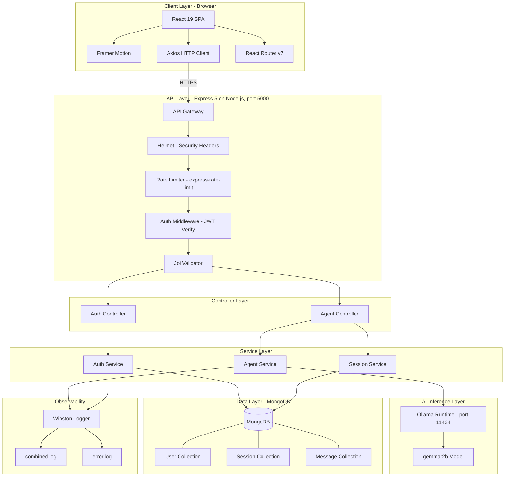
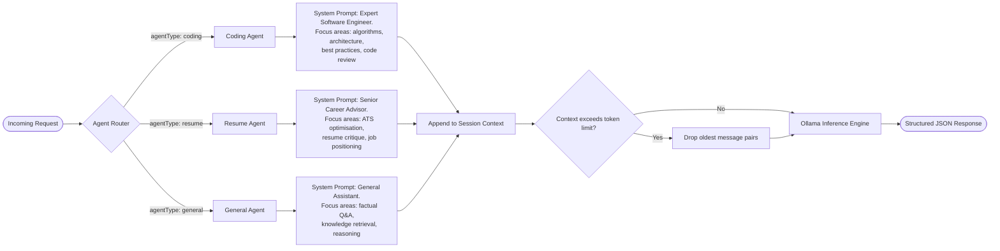
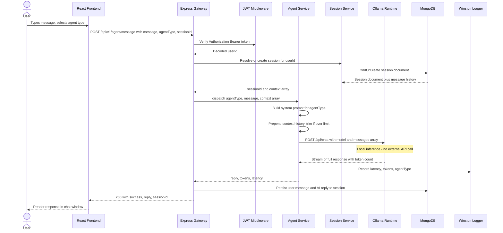
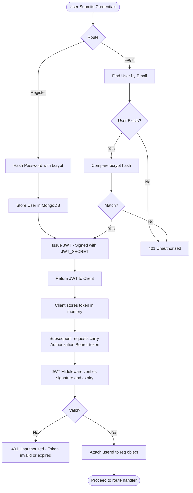
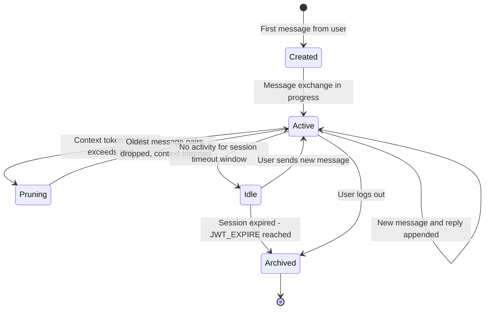
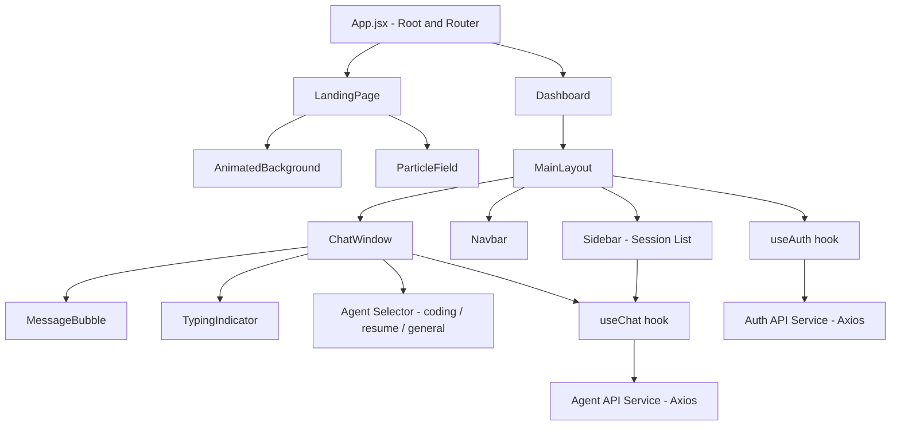

<h1 align="center">DevSphere AI</h1>

<p align="center">
  <strong>A production-grade, multi-agent AI platform engineered for developers</strong><br/>
  Intelligent coding assistance, resume analysis, and general-purpose conversational AI — powered by a self-hosted Ollama inference backend.
</p>

<p align="center">
  <a href="https://devsphere-ai-olive.vercel.app" target="_blank">
    
  </a>
</p>

<p align="center">
  <a href="LICENSE"></a>
  
  
  
  
  
  
  
</p>

<p align="center">
  <a href="https://github.com/hardikkaurani/devsphere-ai"></a>
  <a href="https://github.com/hardikkaurani/devsphere-ai/issues"></a>
  <a href="https://github.com/hardikkaurani/devsphere-ai"></a>
</p>

---

## Live Demo

**[devsphere-ai-olive.vercel.app](https://devsphere-ai-olive.vercel.app)**

> Note: The hosted demo connects to a deployed Ollama instance. For full local control (custom models, no rate limits), follow the [Installation](#installation) steps to run DevSphere AI on your own machine.

---

## Table of Contents

- [Overview](#overview)
- [System Architecture](#system-architecture)
- [Agent Design](#agent-design)
- [Agent Decision Matrix](#agent-decision-matrix)
- [Tech Stack](#tech-stack)
- [Data Flow](#data-flow)
- [Authentication Flow](#authentication-flow)
- [Session Lifecycle](#session-lifecycle)
- [Component Hierarchy](#component-hierarchy)
- [Project Structure](#project-structure)
- [Prerequisites](#prerequisites)
- [Environment Configuration](#environment-configuration)
- [Installation](#installation)
- [Running the Application](#running-the-application)
- [API Reference](#api-reference)
- [Error Handling](#error-handling)
- [Logging](#logging)
- [Performance Notes](#performance-notes)
- [Contributing](#contributing)
- [Roadmap](#roadmap)
- [License](#license)

---

## Overview

DevSphere AI is a full-stack, self-hosted AI assistant platform built around a modular, agent-based architecture. Rather than calling a single general-purpose model endpoint, requests are routed to purpose-built agents — each with domain-specific system prompts, context strategies, and response behaviours.

The backend is a hardened Express.js REST API (v5) that communicates with Ollama, an open-source local model runner, eliminating dependency on third-party API keys and data egress. The frontend is a React 19 SPA built with Vite, styled with Tailwind CSS, and animated with Framer Motion, delivering a production-quality UI that rivals commercial AI platforms.

Key design decisions:

- **Agent isolation**: Each agent type (coding, resume, general) maintains its own session context and system prompt, preventing cross-contamination of conversational state.
- **Local inference**: Ollama runs models entirely on-device or on-premise. No data leaves your infrastructure.
- **JWT-secured sessions**: All agent interactions require authenticated sessions, enabling per-user conversation history and session management.
- **Structured logging**: Winston-powered logging with separate streams for combined and error logs.
- **Stateless API, stateful sessions**: The Express layer itself holds no in-memory state — all session context lives in MongoDB, so the backend can be horizontally scaled behind a load balancer without sticky sessions.

---

## System Architecture

The following diagram describes the high-level component topology of DevSphere AI.



---

## Agent Design

Each agent is a stateful entity with its own identity and response profile. The routing logic selects the appropriate agent based on the `agentType` field in the request payload.



---

## Agent Decision Matrix

A quick reference for how each agent behaves differently given the same underlying model.

| Aspect | Coding Agent | Resume Agent | General Agent |
|---|---|---|---|
| Primary use case | Debugging, code review, architecture advice | Resume critique, ATS optimisation, career framing | Open-ended Q&A, reasoning, explanations |
| System prompt tone | Technical, precise, references best practices | Constructive, professional, recruiter-aware | Neutral, conversational |
| Context window priority | Recent code snippets retained verbatim | Full resume text retained across turns | Sliding window — oldest pruned first |
| Typical output format | Code blocks, bullet explanations | Structured feedback with section headers | Free-form prose |
| Session field used | `agentType: "coding"` | `agentType: "resume"` | `agentType: "general"` |

---

## Tech Stack

### Frontend

| Technology | Version | Purpose |
|---|---|---|
| React | 19 | UI component library |
| Vite | Latest | Build toolchain and dev server |
| Tailwind CSS | v3 | Utility-first CSS framework |
| Framer Motion | Latest | Declarative animation engine |
| Lucide React | Latest | SVG icon library |
| Axios | Latest | Typed HTTP client |
| React Router | v7 | Client-side routing |

### Backend

| Technology | Version | Purpose |
|---|---|---|
| Node.js | v18+ | JavaScript runtime |
| Express | v5 | Web framework |
| MongoDB | Latest | Primary NoSQL datastore |
| Mongoose | Latest | MongoDB ODM |
| JSON Web Token | Latest | Stateless auth tokens |
| bcrypt | Latest | Password hashing |
| Ollama | Latest | Local AI model runtime |
| Winston | Latest | Structured logging |
| Joi | Latest | Schema validation |
| Helmet | Latest | HTTP security headers |
| express-rate-limit | Latest | Brute-force protection |

### Tooling

| Tool | Purpose |
|---|---|
| Nodemon | Hot-reload for backend development |
| ESLint (Airbnb config) | Static code analysis |
| Git | Version control |
| concurrently | Run frontend and backend in parallel |
| Vercel | Frontend hosting for live demo |

---

## Data Flow

The following sequence diagram illustrates a complete request lifecycle — from user input through authentication, agent dispatch, Ollama inference, and response persistence.



---

## Authentication Flow



---

## Session Lifecycle

How a conversation session moves through its states from creation to context pruning.



---

## Component Hierarchy

A simplified view of how the React frontend is composed.



---

## Project Structure

```
devsphere-ai/
|
+-- backend/                        # Node.js / Express API server
|   +-- src/
|   |   +-- config/                 # Environment, DB, and Ollama configuration
|   |   +-- controllers/            # Route handler functions (thin layer)
|   |   |   +-- auth.controller.js
|   |   |   +-- agent.controller.js
|   |   +-- services/               # Core business logic
|   |   |   +-- auth.service.js
|   |   |   +-- agent.service.js    # Agent dispatch + Ollama communication
|   |   |   +-- session.service.js  # Session CRUD + context assembly
|   |   +-- models/                 # Mongoose schemas
|   |   |   +-- User.model.js
|   |   |   +-- Session.model.js
|   |   |   +-- Message.model.js
|   |   +-- middleware/             # Express middleware
|   |   |   +-- auth.middleware.js  # JWT verification
|   |   |   +-- error.middleware.js # Centralised error handler
|   |   |   +-- validate.middleware.js
|   |   +-- routes/                 # Express Router definitions
|   |   |   +-- auth.routes.js
|   |   |   +-- agent.routes.js
|   |   +-- utils/                  # Pure helper functions, logger setup
|   |   +-- index.js                # Application entry point
|   +-- package.json
|
+-- devsphere-frontend/             # React 19 SPA (Vite)
|   +-- src/
|   |   +-- components/
|   |   |   +-- ui/                 # Primitive components: Button, Card, Input, Badge
|   |   |   +-- chat/               # ChatWindow, MessageBubble, TypingIndicator
|   |   |   +-- layout/             # MainLayout, Sidebar, Navbar
|   |   |   +-- animations/         # AnimatedBackground, ParticleField
|   |   +-- pages/
|   |   |   +-- LandingPage.jsx
|   |   |   +-- Dashboard.jsx
|   |   +-- services/               # Axios API client wrappers
|   |   +-- hooks/                  # Custom React hooks (useChat, useAuth, etc.)
|   |   +-- utils/                  # Pure utilities
|   |   +-- constants/              # Enums, config constants, agent definitions
|   |   +-- App.jsx                 # Root component + route definitions
|   |   +-- main.jsx                # React DOM entry point
|   +-- vite.config.js
|   +-- tailwind.config.js
|   +-- package.json
|
+-- docs/                           # Extended documentation
+-- logs/                           # Runtime logs (gitignored)
|   +-- combined.log
|   +-- error.log
+-- .env.example                    # Environment variable template
+-- package.json                    # Root scripts (dev:all, build, etc.)
+-- README.md
```

---

## Prerequisites

Ensure the following are installed and running before setup:

| Requirement | Version | Notes |
|---|---|---|
| Node.js | v18 or higher | [nodejs.org](https://nodejs.org/) |
| npm | v9 or higher | Bundled with Node.js |
| MongoDB | v6+ | Local instance or [MongoDB Atlas](https://www.mongodb.com/atlas) |
| Ollama | Latest | [ollama.ai](https://ollama.ai/) |
| Git | Any | For cloning the repository |

### Pulling an Ollama Model

DevSphere AI is configured by default for `gemma:2b`. Other compatible models include `mistral`, `neural-chat`, and `llama3`.

```bash
# Default model (recommended for low-resource machines)
ollama pull gemma:2b

# Alternatives
ollama pull mistral
ollama pull neural-chat
ollama pull llama3
```

Verify Ollama is running:

```bash
ollama list
# Should display pulled models and their disk usage
```

| Model | Approx. RAM Required | Best For |
|---|---|---|
| `gemma:2b` | 4 GB | Low-resource machines, fast responses |
| `mistral` | 8 GB | Balanced quality and speed |
| `neural-chat` | 8 GB | Conversational tone |
| `llama3` | 8-16 GB | Highest quality responses |

---

## Environment Configuration

Copy the provided template and populate all values before starting any service.

```bash
cp .env.example .env
```

```env
# ── Database ────────────────────────────────────────────────────────────────
MONGO_URI=mongodb://localhost:27017/devsphere-ai

# ── Server ──────────────────────────────────────────────────────────────────
PORT=5000
NODE_ENV=development

# ── Authentication ───────────────────────────────────────────────────────────
# Use a cryptographically random string of at least 64 characters in production
JWT_SECRET=your-super-secret-key-change-in-production
JWT_EXPIRE=7d

# ── CORS ─────────────────────────────────────────────────────────────────────
CORS_ORIGIN=http://localhost:5173

# ── Ollama Inference ──────────────────────────────────────────────────────────
OLLAMA_BASE_URL=http://localhost:11434
OLLAMA_MODEL=gemma:2b

# ── Logging ───────────────────────────────────────────────────────────────────
LOG_LEVEL=info
```

> **Security note**: Never commit `.env` to version control. The `.env.example` file should contain only placeholder values. Rotate `JWT_SECRET` immediately in any environment that has been exposed.

---

## Installation

### Step 1 — Clone the Repository

```bash
git clone https://github.com/hardikkaurani/devsphere-ai.git
cd devsphere-ai
```

### Step 2 — Install Dependencies

```bash
# Root-level dependencies (concurrently, etc.)
npm install

# Frontend dependencies
cd devsphere-frontend && npm install && cd ..

# Backend dependencies
cd backend && npm install && cd ..
```

### Step 3 — Configure Environment

```bash
cp .env.example .env
# Edit .env with your local values
```

---

## Running the Application

### Option A — Run Services Individually (Recommended for Development)

**Terminal 1 — Backend API:**

```bash
cd backend
npm run dev
# Starts on http://localhost:5000 with Nodemon hot-reload
```

**Terminal 2 — Frontend Dev Server:**

```bash
cd devsphere-frontend
npm run dev
# Starts on http://localhost:5173 with Vite HMR
```

### Option B — Run Both Concurrently

```bash
npm run dev:all
# Uses concurrently to run both services from the root
```

### Application URLs

| Service | URL | Description |
|---|---|---|
| Live Demo | https://devsphere-ai-olive.vercel.app | Hosted production frontend |
| Frontend (local) | http://localhost:5173 | React SPA |
| Backend API (local) | http://localhost:5000 | Express REST API |
| Health Check | http://localhost:5000/health | Server + DB status |
| Ollama | http://localhost:11434 | Local AI inference engine |

---

## API Reference

All endpoints are prefixed with `/api/v1`. Protected routes require a valid JWT in the `Authorization` header.

```
Authorization: Bearer <your_jwt_token>
```

### Authentication Endpoints

| Method | Endpoint | Auth Required | Description |
|---|---|---|---|
| `POST` | `/api/v1/auth/register` | No | Create a new user account |
| `POST` | `/api/v1/auth/login` | No | Authenticate and receive JWT |
| `POST` | `/api/v1/auth/logout` | Yes | Invalidate the current session |

**Register — Request Body:**

```json
{
  "email": "user@example.com",
  "password": "StrongPassword123!"
}
```

**Login — Response:**

```json
{
  "success": true,
  "token": "eyJhbGciOiJIUzI1NiIsInR5cCI6IkpXVCJ9...",
  "user": {
    "id": "64f2a...",
    "email": "user@example.com"
  }
}
```

---

### Agent Endpoints

| Method | Endpoint | Auth Required | Description |
|---|---|---|---|
| `POST` | `/api/v1/agent/message` | Yes | Send message to a specified AI agent |
| `GET` | `/api/v1/agent/sessions` | Yes | List all sessions for the authenticated user |
| `GET` | `/api/v1/agent/sessions/:id` | Yes | Retrieve full message history for a session |

**Send Message — Request Body:**

```json
{
  "message": "How do I optimize re-renders in React using useMemo?",
  "agentType": "coding",
  "sessionId": "optional-existing-session-id"
}
```

**Send Message — Response:**

```json
{
  "success": true,
  "message": "Message processed",
  "reply": "To optimize re-renders with useMemo, you should...",
  "sessionId": "64f3b..."
}
```

**Agent Type Values:**

| Value | Agent | Domain |
|---|---|---|
| `coding` | Coding Agent | Software engineering, debugging, architecture |
| `resume` | Resume Agent | Career guidance, ATS, resume critique |
| `general` | General Agent | General knowledge and reasoning |

---

### Health Check

```bash
GET /health

# Response
{
  "status": "ok",
  "uptime": 3600,
  "db": "connected",
  "timestamp": "2025-01-01T00:00:00.000Z"
}
```

---

### cURL Examples

**Authenticate:**

```bash
curl -X POST http://localhost:5000/api/v1/auth/login \
  -H "Content-Type: application/json" \
  -d '{ "email": "user@example.com", "password": "StrongPassword123!" }'
```

**Send a message to the Coding Agent:**

```bash
curl -X POST http://localhost:5000/api/v1/agent/message \
  -H "Content-Type: application/json" \
  -H "Authorization: Bearer YOUR_JWT_TOKEN" \
  -d '{
    "message": "Explain the difference between useMemo and useCallback.",
    "agentType": "coding"
  }'
```

**Retrieve all sessions:**

```bash
curl -X GET http://localhost:5000/api/v1/agent/sessions \
  -H "Authorization: Bearer YOUR_JWT_TOKEN"
```

---

## Error Handling

All errors follow a consistent JSON envelope, enabling predictable client-side handling.

```json
{
  "success": false,
  "message": "User already exists",
  "statusCode": 409,
  "errors": {
    "email": "Email is already in use"
  }
}
```

Standard HTTP status codes used across the API:

| Code | Meaning |
|---|---|
| `200` | Success |
| `201` | Resource created |
| `400` | Bad request / validation failure |
| `401` | Unauthenticated (missing or invalid JWT) |
| `403` | Forbidden (authenticated but not authorised) |
| `404` | Resource not found |
| `409` | Conflict (e.g. duplicate email) |
| `429` | Rate limit exceeded |
| `500` | Internal server error |

All unhandled exceptions are caught by the centralised `error.middleware.js` and formatted consistently before being sent to the client. Stack traces are only included in `NODE_ENV=development`.

---

## Logging

Logs are written to the `logs/` directory using Winston with two transport streams:

| File | Contents |
|---|---|
| `logs/combined.log` | All log levels: `info`, `warn`, `error`, `debug` |
| `logs/error.log` | Errors only — suitable for alerting and monitoring |

Log level is controlled via the `LOG_LEVEL` environment variable. Console output is colourised in development. Log entries are structured JSON, making them compatible with log aggregation tools such as Datadog, Loki, or the ELK stack.

Sample log entry:

```json
{
  "level": "info",
  "message": "Agent message dispatched",
  "agentType": "coding",
  "sessionId": "64f3b...",
  "latencyMs": 843,
  "timestamp": "2025-01-01T12:00:00.123Z"
}
```

---

## Performance Notes

- **Cold start latency**: The first request to a freshly pulled Ollama model is slower as the model loads into memory. Subsequent requests are significantly faster.
- **Context pruning**: Sessions automatically drop the oldest message pairs once the context approaches the model's token limit, keeping inference latency predictable.
- **Rate limiting**: `express-rate-limit` is applied at the gateway level to prevent abuse and protect the local Ollama runtime from being overwhelmed by concurrent requests.
- **MongoDB indexing**: The `Session` and `Message` collections are indexed on `userId` and `sessionId` to keep history retrieval fast as conversation volume grows.

---

## Production Build

```bash
# Build the React frontend
cd devsphere-frontend && npm run build
# Output: devsphere-frontend/dist/

# The backend requires no build step
# Start production server
cd backend && NODE_ENV=production node src/index.js
```

For containerised deployments, it is recommended to serve the frontend `dist/` via Nginx as a static file server and proxy API requests to the Node.js backend.

---

## Contributing

Contributions are welcome. Please adhere to the following workflow:

1. Fork the repository and create your branch from `main`:
   ```bash
   git checkout -b feature/your-feature-name
   ```

2. Write meaningful commits following [Conventional Commits](https://www.conventionalcommits.org/en/v1.0.0/):
   ```
   feat: add streaming support for agent responses
   fix: resolve JWT expiry edge case on login
   docs: update API reference for /agent/sessions
   ```

3. Ensure the linter passes:
   ```bash
   cd devsphere-frontend && npm run lint
   ```

4. Open a Pull Request against `main` with a clear description of the change and its motivation.

### Code Standards

- Follow the [Airbnb JavaScript Style Guide](https://github.com/airbnb/javascript)
- Keep functions small, pure where possible, and well-named
- Separate concerns cleanly — controllers should not contain business logic; services should not contain HTTP-specific code
- All new API routes must include Joi validation schemas
- Do not commit `.env` files, secrets, or build artifacts

---

## Roadmap

The following capabilities are planned for future releases:

- User authentication UI and profile management
- Conversation export (Markdown, JSON, PDF)
- WebSocket support for real-time streaming responses
- Custom agent creation with user-defined system prompts
- Team workspaces and shared session history
- API rate limiting dashboard with per-user analytics
- Advanced observability: request tracing, token usage tracking
- Mobile application (React Native)
- Docker Compose setup for one-command deployment
- Support for additional Ollama models via settings panel

---

## License

This project is licensed under the MIT License. See the [LICENSE](LICENSE) file for the full text.

---

## Contact and Support

- **Author**: Hardik Kaurani
- **Live Demo**: [devsphere-ai-olive.vercel.app](https://devsphere-ai-olive.vercel.app)
- **Email**: hardikkaurani2@gmail.com
- **Issues**: [GitHub Issues](https://github.com/hardikkaurani/devsphere-ai/issues)
- **Discussions**: [GitHub Discussions](https://github.com/hardikkaurani/devsphere-ai/discussions)

---

<p align="center">
  <em>Built for developers who take their tooling seriously.</em><br/><br/>
  Made with care by <strong>Hardik Kaurani</strong>
  &nbsp;·&nbsp;
  <a href="https://devsphere-ai-olive.vercel.app">Live Demo</a>
</p>
